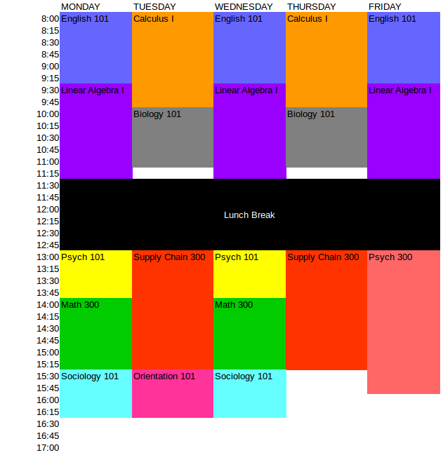

# Schedule Generator Demo
### Branch-and-Prune Discrete Optimization

Companion blog article can be [found here](http://tomstechnicalblog.blogspot.com/2018/02/linear-programming-with-kotlin-part-iii.html).

This was an exercise at creating a class schedule generator using [branch-and-bound optimization](https://en.wikipedia.org/wiki/Branch_and_bound) and constraint propogation. 

I initially used [Kotlin](http://kotlinlang.org/) with [ojAlgo](http://www.ojalgo.org/), which turned out to be effective. However, I found implementing from scratch gave me more control and allowed me to optimize for the specific problem. Both implementations are in this repo. 

For now, the model just assumes we are scheduling against one room.


## Data Input

Here is the starting data set:

**Classrooms:**

1) Psych 101 (1 hour, 2 sessions/week)
2) English 101 (1.5 hours, 2 sessions/week)
3) Math 300 (1.5 hours, 2 sessions/week)
4) Psych 300 (3 hours, 1 session/week)
5) Calculus I (2 hours, 2 sessions/week)
6) Linear Algebra I (2 hours, 3 sessions/week)
7) Sociology 101 (1 hour, 2 sessions/week)
8) Biology 101 (1 hour, 2 sessions/week)
9) Supply Chain 300 (2.5 hours, 2 sessions/week)
10) Orientation 101 (1 hours, 1 session/week)

I set the model to put each recurring session 48 hours apart.

**Availability for each day Monday-Friday:**

* 8:00AM-11:30AM
* 1:00PM-5:00PM

## Output

```
Psych 101- MONDAY/WEDNESDAY 13:00-14:00
English 101- MONDAY/WEDNESDAY/FRIDAY 08:00-09:30
Math 300- MONDAY/WEDNESDAY 14:00-15:30
Psych 300- FRIDAY 13:00-16:00
Calculus I- TUESDAY/THURSDAY 08:00-10:00
Linear Algebra I- MONDAY/WEDNESDAY/FRIDAY 09:30-11:30
Sociology 101- MONDAY/WEDNESDAY 15:30-16:30
Biology 101- TUESDAY/THURSDAY 10:00-11:00
Supply Chain 300- TUESDAY/THURSDAY 13:00-15:30
Orientation 101- TUESDAY 15:30-16:30
```



Obviously, a room cannot be occupied by more than one class at any time. The solver does this successfully and prevents any overlap in scheduling. 


## How to Execute

Build the Kotlin project with Gradle, then run the `main()` function inside the `InputAndRun.kt` file. You can also change the hardcoded inputs in that file too.

The optimizer should hopefully run in a few seconds and then display the schedule in the console output. 


## Resources

[Coursera Class on Discrete Optimization](https://www.coursera.org/learn/discrete-optimization/home/welcome)
